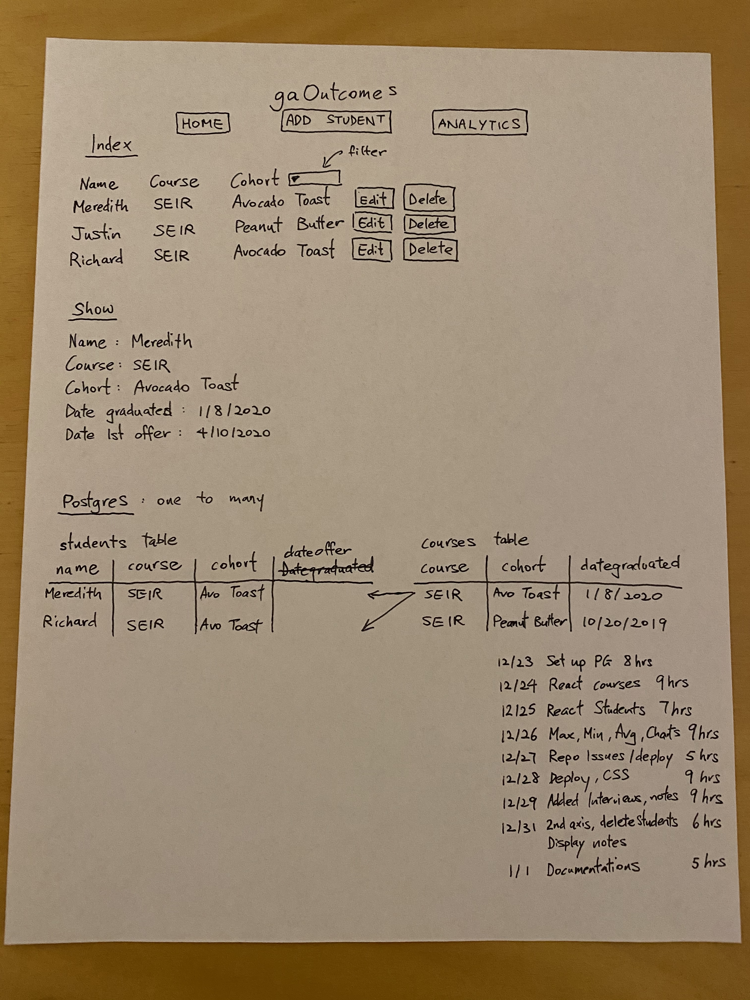
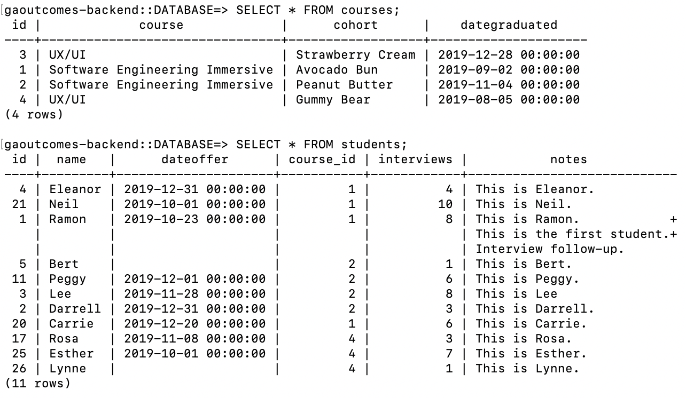

# WHAT'S NEXT? @gaOutcomes

## Link to Live Website

https://gaoutcomes-frontend.herokuapp.com/

## Two Separate Repo to Deploy
https://github.com/wlaw019/gaoutcomes_frontend  
https://github.com/wlaw019/gaoutcomes-backend

## Original Single Repo
https://github.com/wlaw019/wlaw019.github.io

## Overview

gaOutcomes tracker built for General Assembly career coaches.  App can summarize and chart quantitative data identifying students in need of attentions.  Notes can be added for each student to aid follow-up.  

## Features

- User can create course and cohort with different graduation date.  Data goes into the Postgres table "courses"
- User can edit and delete a specific course.  Corresponding students taking that course will also be deleted from a separate Postgres table "students"
- User can add students to a specific course.  Data goes into the Postgres table "students" with foreign course_id key.
- User can add and edit date of 1st offer, number of interviews and also be able to delete the student from a course.
- Search Time = Date of 1st offer - Graduation date unless it is in pending status, then the Search Time will be based on today's date.
- Forms can be not submitted unless all the required fields are completed
- Highlight student with the longest Search Time within a course
- Toggle Notes to display

## Resources Used

- https://node-postgres.com/features/connecting
- https://expressjs.com/en/resources/middleware/cors.html
- https://medium.com/@olinations/build-a-crud-template-using-react-bootstrap-express-postgres-9f84cc444438
- https://www.taniarascia.com/node-express-postgresql-heroku/#deploy-app-to-heroku
- https://blog.logrocket.com/setting-up-a-restful-api-with-node-js-and-postgresql-d96d6fc892d8/
- http://www.postgresqltutorial.com/postgresql-add-column/
- https://devconnected.com/how-to-unstage-files-on-git/
- https://dev.to/paulasantamaria/change-the-timezone-on-a-heroku-app-2b4
- https://blog.bitsrc.io/customizing-chart-js-in-react-2199fa81530a
- https://imagecolorpicker.com/en

## Wire Framing


## Technologies Used

- HTML
- CSS
- JavaScript
- ReactJS
- Node
- Express
- PostgresSQL
- Chart.js
- Heroku
- Postman

## Backend Dependencies

- cors
- dotenv
- express
- pg

## gaoutcomes-backend

- table.sql: codes to initialize the database
```terminal
cat init.sql | heroku pg:psql postgresql-animate-01864 --app gaoutcomes-backend
```
- controllers: courses.js and students.js
- server.js

### students.js (5 Routes)
- GET: get all students left join courses and ordered by student's name
- POST: create a new student.  Modify interviews and dateoffer if empty string in order to satisfy data type specified in the database
- PUT: edit a student.  Modify interviews if empty string
- DELETE: '/:id' to delete a specific student
- DELETE: '/course/:id' to delete all the students within a course

### courses.js (4 Routes)
- GET: get all courses
- POST: create a new course
- PUT: edit a course
- DELETE: delete a specific student

## gaoutcomes-frontend
- 6 Components + App.js

### App.js JSX structure
```html
1  <div className = "container">
2  
3      <header>@gaOutcomes</header>
4
5      <nav>
6         {this.state.view.page ? <h3></h3>: null}   
7      </nav>
8      
9      <h3>{this.state.view.pageTitle}</h3>
10     
11     {this.state.view.page?
12      <Courses />
13      <FormCourse />
14      <Students />
15      <FormStudent />
16      : null}
17
18  </div>
```

### Students.js JSX structure
```html
1     
2     {this.state.isShow?
3      <Notes />
4      <Analytics />
5      : null}
6
```
### App.js functions
#### handleView
- Change the state of the view so that appropriate Component shows up
- Pre-populates form inputs for FormCourse.js and FormStudent.js

#### handleCreate
- Create a new Course or Student depending on this.state.view.page

#### handleUpdate
- Edit a Course or Student depending on this.state.view.page

#### handleDelete
- Delete a Course or Student depending on this.state.view.page

#### handleDeleteStudents
- Delete all corresponding students within a course

#### handleStudents
- Filter out the students with a specific course_id for Students.js

#### handleAllStudents
- Get all students to calculate %Success on page loads

#### fetchCourses
- Get all courses on page loads

### Students.js functions
#### isShow
- Toggle between Notes.js and Analytics.js
- Obtain name and notes of a particular student onClick

#### getDays
- Calculates min, max and average Search Time
